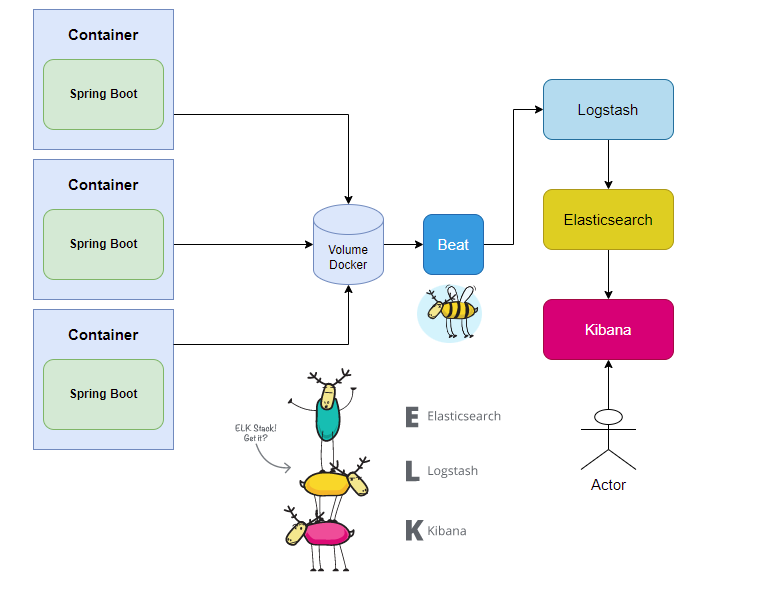

# ELK - Stack

The purpose of this project is to simulate an environment of microservices that centralize the logs in the ELK for further analysis.

For this project i will use Spring boot for micro services, Docker compose for orchestrate and configuration.

What is ELK?

ELK took its place very quickly in the world of logs and metrics, mainly because it is open-source and highly scalable. Together they form a powerful data analysis platform.

## [Beats](https://www.elastic.co/pt/beats/)

lightweight data agents
Beats is a free and open platform for single-purpose data brokers. They send data from hundreds or thousands of computers and systems to Logstash or Elasticsearch.

Send straight from the source. That simple.
Beats are great for gathering data. They live on your servers, with your containers, or are deployed as roles — and then centralize the data in Elasticsearch. Beats send data that conforms to the Elastic Common Schema (ECS), and if you need more processing power, they can route it to Logstash for transformation and analysis.

## [Logstash](https://www.elastic.co/pt/logstash/)

Centralize, transform and hide your data

Logstash is a free and open server-side data processing pipeline that ingests data from numerous sources, transforms it, and sends it to your favorite "cave".

Ingest data of all shapes, sizes and sources

Data is often dispersed or isolated across many systems and in many formats. Logstash supports a variety of inputs that import events from numerous common sources all at the same time. Seamlessly ingest logs, metrics, web applications, data stores, and various AWS services, all in one continuous flow.

Analyze and transform data immediately

As data travels from source to storage, Logstash filters analyze each event, identify named fields to build structure, and transform them to converge into a common format to provide more powerful analysis and business value.

Logstash dynamically transforms and prepares data, regardless of format or complexity:

Get the structure of unstructured data with grok
Decipher geographic coordinates from IP addresses
Anonymize PII data, delete sensitive fields completely
Facilitate general processing, regardless of data source, format, or schema.

## [Elasticsearch](https://www.elastic.co/pt/elasticsearch/)

Elasticsearch is a distributed RESTful search and data analysis engine capable of serving an increasing number of use cases. As a core element of the Elastic Stack, it stores your data centrally for fast search, fine-tuned relevance, and powerful analytics that can be easily scaled.

## [Kibana](https://www.elastic.co/pt/kibana/)

Your window to the Elastic Stack

Kibana is a free and open user interface for you to visualize your Elasticsearch data and browse the Elastic Stack. Do anything from monitoring query load to understanding how requests flow through your apps.

A picture is worth a thousand log lines

Kibana gives you the freedom to select the way you shape your data. With interactive visualizations, start with a question and see where it takes you.

